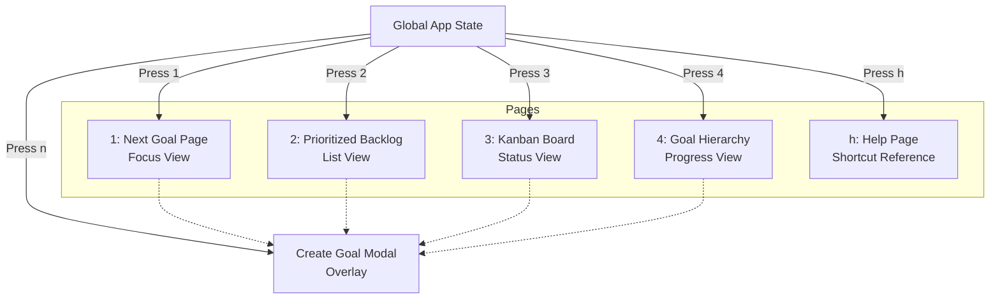

# Next Goal - TUI Client

This directory contains the Terminal User Interface (TUI) client for the **Next Goal** application.

## Overview

The TUI is designed to give you a fast, keyboard-driven interface to track your immediate next goal directly from your terminal. It is built in [Haskell](https://www.haskell.org/) using the [Brick](https://hackage.haskell.org/package/brick) library for the user interface and the [RIO](https://hackage.haskell.org/package/rio) standard library for safe, efficient, and well-structured application architecture.

## Prerequisites

If you are not using the Nix development shell provided in the root of the repository, you will need to install the following dependencies manually:

- [GHC](https://www.haskell.org/ghc/) (Glasgow Haskell Compiler)
- [Cabal](https://www.haskell.org/cabal/) or [Stack](https://docs.haskellstack.org/en/stable/)

## Building and Running

*Instructions for building and running the client will be added here once the Cabal project structure is initialized.*

## Architecture

The TUI utilizes a multi-page routing structure, allowing the user to seamlessly switch between different views of their goals, while global actions (like creating a new goal) are accessible from anywhere as an overlay.

### Application Pages

As the Next Goal ecosystem grows, this TUI will integrate with future backend services (such as a Kafka-based event stream) to sync and manage goals across different interfaces alongside other potential clients (like a Web UI).
